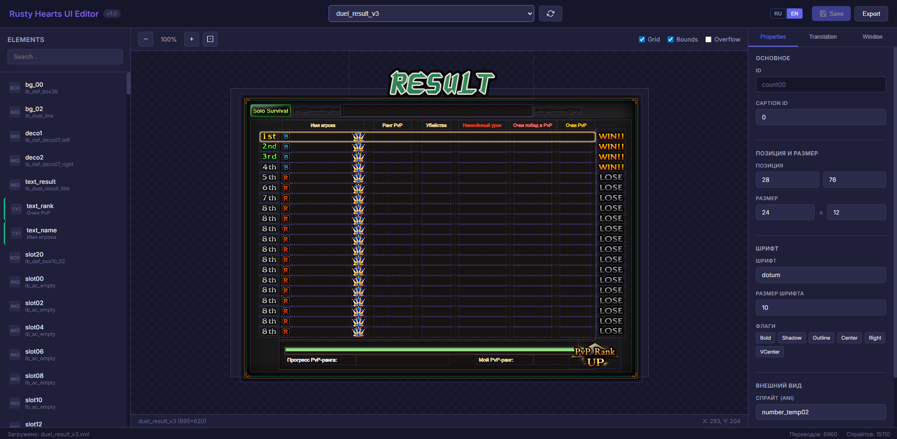

# Rusty Hearts UI Editor

[Русская версия](README.md)

Visual UI editor for the game Rusty Hearts. Allows viewing and editing game interfaces with translation support.



## Features

- **UI Window Viewer** — load and display XML interface files
- **Sprite Rendering** — support for all sprite types (static, button, 9-slice, gauge, scroll, etc.)
- **Translation Management** — load translations from XLSX files, real-time editing
- **Tag Support** — correct rendering of `<BR>`, `<color:RRGGBB>`, `</color>` and other game tags
- **Editing** — modify position, size, font of elements
- **Overflow Detection** — visual indication of text exceeding element boundaries
- **Multilingual** — interface in Russian and English

## Installation

1. Install [Node.js](https://nodejs.org/) (version 16+)

2. Clone the repository:
```bash
git clone https://github.com/your-repo/rusty-hearts-ui-editor.git
cd rusty-hearts-ui-editor
```

3. Install dependencies:
```bash
npm install
```

4. Configure paths in `server.js`:
```javascript
const CONFIG = {
    UI_PATH: 'path/to/ui/files',
    TRANSLATIONS_PATH: 'path/to/translations',
    RESOURCES_PATH: 'path/to/resources'
};
```

5. Start the server:
```bash
npm start
```

6. Open in browser: http://localhost:3847

## Project Structure

```
EDIT/
├── server.js          # Backend server (Express)
├── package.json       # Node.js dependencies
├── public/
│   ├── index.html     # Main page
│   ├── styles.css     # Styles
│   └── app.js         # Frontend logic
└── README.md
```

## Usage

1. Select a window from the dropdown list
2. Click on an element to select it
3. Edit properties in the right panel
4. To edit translation, go to the "Translation" tab
5. Text changes are displayed in real-time
6. Click "Save" to save changes

### Keyboard Shortcuts

- `Ctrl+S` — save changes
- `Escape` — deselect
- `Arrow keys` — move selected element
- `Shift+Arrow keys` — move with 10px step
- `Ctrl+Mouse wheel` — zoom

## Supported Sprite Types

| Type | Description |
|------|-------------|
| static | Static image |
| button | Button (3-4 states) |
| pushbutton | Push button |
| checkbutton | Checkbox |
| gauge | Progress bar |
| v_scroll | Vertical scrollbar |
| combo | Dropdown list |
| edit | Text field |
| 9-slice | Stretchable frame |

## License

Free to use with attribution.

```
Copyright (c) 2024

Permission is granted to use, copy, modify, and distribute this software 
by any person for any purpose, provided that this copyright notice is retained.

THE SOFTWARE IS PROVIDED "AS IS", WITHOUT WARRANTY OF ANY KIND.
```

## Authors

- Development: Rusty Hearts Community
